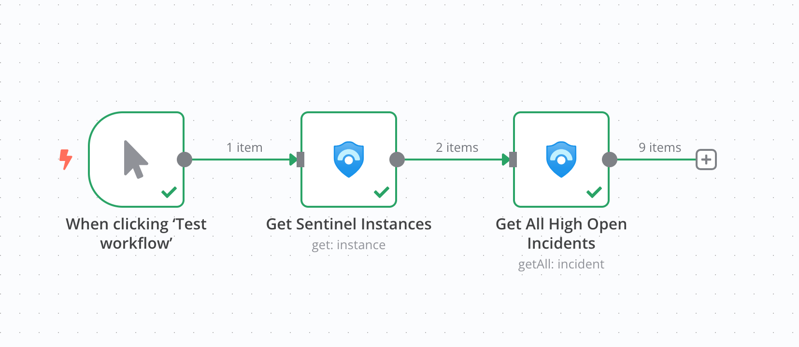
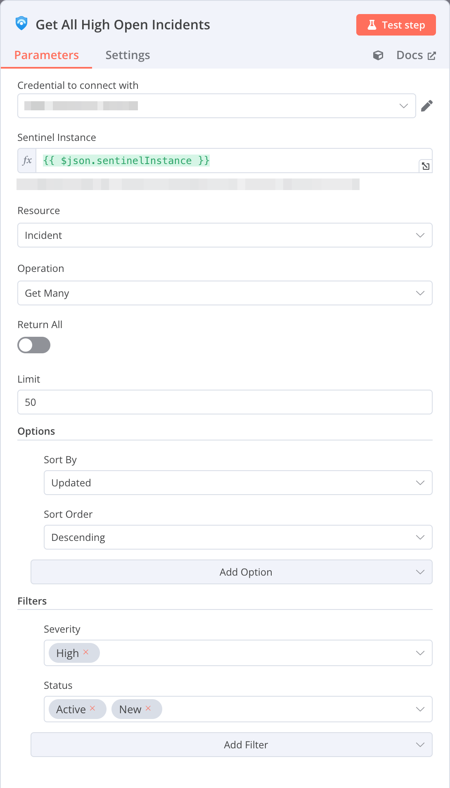

# n8n-nodes-microsoft-sentinel

This is an n8n community node. It lets you interact with Microsoft Sentinel workspaces and resources.

[n8n](https://n8n.io/) is a [fair-code licensed](https://docs.n8n.io/reference/license/) workflow automation platform.

[Installation](#installation)
[Example Workflow](#example-workflow)
[Operations](#operations)
[Compatibility](#compatibility)
[Resources](#resources)

## Installation

Follow the [installation guide](https://docs.n8n.io/integrations/community-nodes/installation/) in the n8n community nodes documentation.

## Example Workflow

This workflow will get all available Sentinel instances and retrieve all `Active` and `New` High severity incidents.

<details>
<summary>Node settings</summary>


</details>
<details>
<summary>Workflow JSON</summary>

_Copy and paste the following workflow JSON into your n8n editor to recreate the workflow:_
```json
{
  "nodes": [
    {
      "parameters": {},
      "type": "n8n-nodes-base.manualTrigger",
      "typeVersion": 1,
      "position": [
        -500,
        -40
      ],
      "id": "3e2bb6a5-abd3-4b5e-bb8a-9d1d10595d1c",
      "name": "When clicking ‘Test workflow’"
    },
    {
      "parameters": {
        "resource": "instance",
        "requestOptions": {}
      },
      "type": "n8n-nodes-microsoft-sentinel.microsoftSentinel",
      "typeVersion": 1,
      "position": [
        -280,
        -40
      ],
      "id": "449fe0b6-5e4f-43be-bfec-777bb8693cab",
      "name": "Get Sentinel Instances",
      "credentials": {
        "microsoftSentinelOAuth2Api": {
          "id": "1",
          "name": "Your Sentinel Creds"
        }
      }
    },
    {
      "parameters": {
        "sentinelInstance": "={{ $json.sentinelInstance }}",
        "options": {
          "orderBy": "properties/lastModifiedTimeUtc",
          "sort": "desc"
        },
        "filters": {
          "severity": [
            "High"
          ],
          "status": [
            "Active",
            "New"
          ]
        },
        "requestOptions": {}
      },
      "type": "n8n-nodes-microsoft-sentinel.microsoftSentinel",
      "typeVersion": 1,
      "position": [
        -60,
        -40
      ],
      "id": "63353297-1aa9-468f-8357-717aa0ac009b",
      "name": "Get All High Open Incidents",
      "credentials": {
        "microsoftSentinelOAuth2Api": {
          "id": "1",
          "name": "Your Sentinel Creds"
        }
      }
    }
  ],
  "connections": {
    "When clicking ‘Test workflow’": {
      "main": [
        [
          {
            "node": "Get Sentinel Instances",
            "type": "main",
            "index": 0
          }
        ]
      ]
    },
    "Get Sentinel Instances": {
      "main": [
        [
          {
            "node": "Get All High Open Incidents",
            "type": "main",
            "index": 0
          }
        ]
      ]
    }
  }
}
```
</details>

## **Operations**

**Instance:**
- **Get instances:** Retrieves a list of Sentinel workspaces available to your account

**Alert Rule:**
- **Create or Update:** Creates a new alert rule if it does not exist, or updates an existing alert rule
- **Delete:** Deletes an alert rule
- **Get:** Retrieves an alert rule
- **Get Many:** Retrieves multiple alert rules
- **Get Template:** Retrieves a template for creating an alert rule
- **Get Many Templates:** Retrieves multiple templates for creating alert rules

**Automation Rule:**
- **Create or Update:** Creates a new automation rule if it does not exist, or updates an existing automation rule
- **Delete:** Deletes an automation rule
- **Get:** Retrieves an automation rule
- **Get Many:** Retrieves multiple automation rules

**Incident:**
- **Create or Update:** Creates a new incident if it does not exist, or updates an existing incident
- **Delete:** Deletes an incident
- **Get:** Retrieves an incident
- **Get Many:** Retrieves multiple incidents
- **Get Alerts:** Retrieves alerts associated with an incident
- **Get Entities:** Retrieves entities associated with an incident
- **Create or Update Comment:** Creates a new comment if it does not exist, or updates an existing comment
- **Delete Comment:** Deletes a comment associated with an incident
- **Get Comment:** Retrieves a comment associated with an incident
- **Get Many Comments:** Retrieves comments associated with an incident

**Query:**
- **Run Query:** Runs a Kusto (KQL) query against a Sentinel workspace

## Compatibility

Tested with n8n v1.50.2

## Resources

* [n8n community nodes documentation](https://docs.n8n.io/integrations/community-nodes/)
